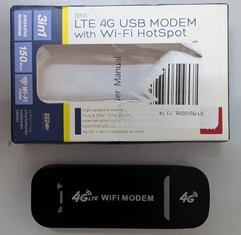
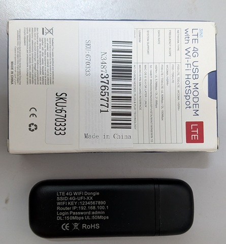
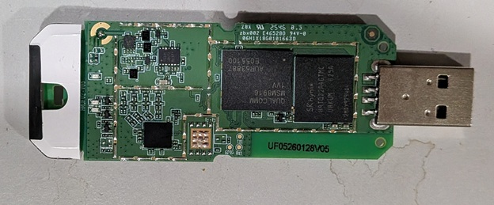
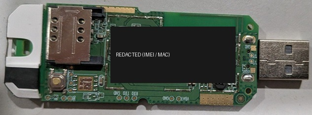

# Flash OpenWrt to a HiMI MSM8916 4G USB Stick

Notes, scripts and gotchas from putting OpenWrt on a cheap **"3IN1 LTE 4G USB MODEM
with Wi-Fi HotSpot"** dongle — the HiMI/UFI family of Qualcomm **MSM8916** sticks —
entirely over **EDL** (Qualcomm Emergency Download Mode), on Windows.

Everything here was done on real hardware. Every command, error message and
workaround below is one that actually came up.

| | |
|---|---|
| SoC | Qualcomm MSM8916 (Snapdragon 410), ARMv8 |
| RAM / eMMC | 512 MB / 4 GB (3.64 GiB = 7,634,944 sectors) |
| Stock firmware | `HiMI_UFI`, Android 4.4.4 (KTU84P), `msm8916_32_512` |
| Board silkscreen | `UF05260128V05` |
| OpenWrt target | `msm89xx/msm8916`, device **`generic-uf02`** |
| Secure boot | **disabled** (no OEM PK hash fused) |
| Sahara HWID | `007050e100000000` |

---

## The hardware

| | |
|---|---|
|  |  |
| Retail packaging — sold as a 150 Mbps 3-in-1 LTE stick. | Factory defaults printed on the label: SSID `4G-UFI-XX`, WiFi key `1234567890`, **router IP `192.168.100.1`**, login `admin`. |

| | |
|---|---|
|  |  |
| PCB front: MSM8916 + SK hynix RAM/eMMC. Board revision `UF05260128V05` on the silkscreen. | PCB back: SIM slot and the UART pads — `EXT TXD`, `EXT RXD`, `GND`, `VBAT`. The label is redacted; it carries the IMEI and MAC. |

> **Redact your own photos.** The sticker on the back has the unit's IMEI and MAC
> in plain text. Do not publish it.

---

## 1. Set up the environment (Windows)

### 1.1 Python

Python 3.10+ ([python.org](https://www.python.org/downloads/), tick *Add to PATH*).

```bash
python -m venv .venv
```

```bash
.venv/Scripts/python.exe -m pip install -r requirements.txt
```

### 1.2 The edl toolkit

```bash
git clone --depth 1 --recurse-submodules https://github.com/bkerler/edl.git
```

`--recurse-submodules` matters — the firehose loaders live in a submodule, and
without them nothing can talk to the device.

### 1.3 libusb

pyusb needs `libusb-1.0.dll` on `PATH`. The edl checkout ships it; unpack the
64-bit build where edl already looks for it:

```bash
"/c/Program Files/7-Zip/7z.exe" e edl/Drivers/Windows/libusb-1.0.26-binaries.7z -oedl/edlclient/Windows "libusb-1.0.26-binaries/VS2015-x64/dll/libusb-1.0.dll" -y
```

Verify a backend exists — this must print a device list, not `backend: None`:

```bash
PATH="$PWD/edl/edlclient/Windows:$PATH" .venv/Scripts/python.exe -c "import usb.core; print([hex(d.idVendor)+':'+hex(d.idProduct) for d in usb.core.find(find_all=True)])"
```

### 1.4 Zadig (WinUSB driver)

With the stick in EDL mode, Windows shows `QHSUSB__BULK` (USB `05C6:9008`) with no
driver. Run **`edl/Drivers/Windows/zadig-2.8.exe`**:

1. *Options → List All Devices*
2. Select **QHSUSB__BULK** (confirm USB ID `05C6 9008`)
3. Choose **WinUSB** and *Install Driver*

Confirm it took:

```bash
powershell.exe -Command "Get-PnpDevice -PresentOnly | Where-Object { \$_.InstanceId -like 'USB\VID_05C6&PID_9008*' } | Format-List FriendlyName, Status, Service"
```

`Service : WinUSB` means you are ready.

---

## 2. Get into EDL mode

The stick enters EDL (USB `05C6:9008`, `QHSUSB__BULK`) when:

- its bootloader is invalid — the mask-ROM PBL falls back automatically; **or**
- you short the **EDL test points** on the PCB while plugging it in.

Once OpenWrt is installed and booting, the stick no longer drops into EDL on its
own — the test points are the way back in. Because the PBL lives in mask ROM and
secure boot is not fused on this hardware, **EDL cannot be flashed away**. That is
the safety net behind everything below.

---

## 3. Back up the device — do this first

Nothing else in this repo is safe until you have a dump. The stock image holds
your **IMEI and radio calibration**, and no download can replace them.

```bash
./scripts/dump-device.sh dump
```

Produces a full raw image (~3.6 GB), a SHA-256, a `manifest.txt`, and every
partition carved out under `dump/partitions/`. Roughly 8–10 minutes.

Reboot out of EDL afterwards:

```bash
./scripts/reset-device.sh
```

---

## 4. Flash OpenWrt

Grab a release from **[hkfuertes/msm8916-openwrt](https://github.com/hkfuertes/msm8916-openwrt/releases)**
and unpack it. For this board use the **`uf02`** build (`generic-uf02`), not `uz801`.

The two device trees are nearly identical — the only functional difference is that
UF02 declares three extra LED GPIOs (71/72/73). Picking the wrong one boots fine and
costs you LED behaviour, not a brick.

With the stick in EDL:

```bash
./scripts/flash-openwrt.sh /path/to/unpacked-release
```

The script backs up the radio partitions, writes the OpenWrt GPT, flashes
`aboot`/`hyp`/`rpm`/`sbl1`/`tz` + `boot` + `rootfs`, restores the radio partitions,
clears the head of `rootfs_data`, and reboots. Android is destroyed.

Verified afterwards on this hardware: six of the seven radio partitions hashed
**byte-identical** to the pre-flash stock dump, so IMEI and calibration survive
intact. (`persist` legitimately changes — OpenWrt writes WLAN calibration there.)

---

## 5. After flashing

The stick appears as a **USB NCM / RNDIS network adapter**. OpenWrt's LAN default
is `192.168.1.1` and LuCI is at `http://192.168.1.1`.

### Address clash — read this before debugging anything

If your home router is *also* `192.168.1.1`, your PC now has two interfaces on
`192.168.1.0/24` with equal route metrics, and **your browser will reach the wrong
device**. This costs hours if you don't know to look for it.

Tell them apart by scoping to the interface:

```bash
powershell.exe -Command "Get-NetNeighbor -IPAddress 192.168.1.1 | Select-Object ifIndex, LinkLayerAddress, State"
```

Two different MACs = two different devices. To reach the stick specifically, use the
IPv6 ULA it hands out — that address is unique to it:

```bash
powershell.exe -Command "Get-NetNeighbor -AddressFamily IPv6 | Where-Object { \$_.State -eq 'Reachable' } | Select-Object ifIndex, IPAddress, LinkLayerAddress"
```

then browse to `http://[fdxx:xxxx:xxxx::1]/`. The permanent fix is to move the
stick's LAN off the clashing subnet (below).

### Move the LAN and enable WiFi

WiFi is **disabled by default** in OpenWrt — the AP does not exist until you create
it. In LuCI (`root`, blank password on first boot):

1. **System → Administration** — set a root password. Until you do, SSH refuses every
   login: dropbear will not authenticate an account with an empty password.
2. **Network → Interfaces → LAN** — set the address to `192.168.100.1` (matches the
   sticker on the box and dodges the clash).
3. **Network → Wireless** — edit `radio0`: Mode *Access Point*, an ESSID, Network
   *lan*, Encryption *WPA2-PSK*, key ≥8 chars. Save & Apply, then **Enable**.

Or over SSH once a password is set:

```bash
ssh root@192.168.100.1 "uci set wireless.radio0.disabled='0'; uci set wireless.default_radio0.ssid='MyOpenWrt'; uci set wireless.default_radio0.encryption='psk2'; uci set wireless.default_radio0.key='CHANGEME8+'; uci commit wireless; wifi reload"
```

### The netmask trap

Setting the LAN address in LuCI can leave you with this in `/etc/config/network`:

```
config interface 'lan'
        list ipaddr '192.168.100.1'      # <-- no prefix length!
```

With no `/24` and no `netmask`, OpenWrt binds it as **`/32`**. The AP then
broadcasts and clients associate, but nobody gets an IP and the gateway is
unreachable, because dnsmasq cannot build a DHCP range:

```
dnsmasq: unable to set dhcp-range for dhcp uci config section 'lan' on interface 'br-lan', please check your config
```

Fix:

```bash
ssh root@192.168.100.1 "uci -q delete network.lan.ipaddr; uci add_list network.lan.ipaddr='192.168.100.1/24'; uci commit network; /etc/init.d/network reload; /etc/init.d/dnsmasq restart"
```

Confirm you get `inet 192.168.100.1/24` from `ip -4 addr show br-lan` and a real
`dhcp-range=` line in `/var/etc/dnsmasq.conf.*`.

WiFi here is **2.4 GHz only** — the WCN3620 radio has no 5 GHz band.

---

## 6. Restore

Back to the exact state you dumped, on **the same stick**, in EDL:

```bash
./scripts/restore-device.sh full dump/emmc_full.bin
```

Or just the parts you broke — much faster, and enough for most failures:

```bash
./scripts/restore-device.sh parts dump/partitions boot rootfs
```

`restore-device.sh` verifies the recorded SHA-256 before writing and refuses a
corrupt image. `edl w <name>` needs a readable GPT on the device; if the table
itself is gone, write by sector with `edl ws` instead.

### Do not restore one stick's image onto another

`modemst1`, `modemst2`, `fsg`, `fsc` and `sec` hold that unit's **IMEI** and
per-unit RF calibration. Copying them clones the IMEI onto a second device —
illegal in many jurisdictions, and it degrades the radio regardless, since
calibration is measured per unit at the factory. `persist` is the same story for
WLAN calibration and MAC.

To set up a second stick: flash it with `flash-openwrt.sh` (which preserves *its*
radio partitions) and carry your settings across as config, not blocks:

```bash
ssh root@192.168.100.1 "sysupgrade -b /tmp/backup.tar.gz" && scp root@192.168.100.1:/tmp/backup.tar.gz .
```

---

## 7. Troubleshooting

**`UnicodeEncodeError: 'charmap' codec can't encode character '█'`**
edl's progress bar is Unicode; a cp1252 console kills the transfer mid-flight.
Always export `PYTHONIOENCODING=utf-8` (the scripts here do).

**`Mode detected: error` on every command afterwards**
The loader is fine — it still has the aborted transfer's data queued. Drain it,
no power cycle needed:

```bash
.venv/Scripts/python.exe scripts/edl-drain.py
```

**`backend: None` from pyusb** — `libusb-1.0.dll` isn't on `PATH`; see §1.3.

**`Error:['No storage drive number']` on erase**
This firehose build rejects the erase command, and edl's fallback zero-writes the
whole partition. Zeroing the first 16 MiB of `rootfs_data` is enough — OpenWrt's
`79-format-rootfs-data` preinit hook makes a fresh ext4 overlay on next boot.

**`USBError(32, 'Pipe error')` after `edl reset`** — normal, that's the device
leaving the bus.

**`edl nop` exits non-zero** — harmless on this loader; it is not a failed link.

**`Sector size in XML 4096 does not match disk sector size 512`** — cosmetic.

**SSH rejects the blank root password** — dropbear refuses empty-password accounts.
Set a password in LuCI first.

---

## Repository layout

```
scripts/
  common.sh            shared setup (edl path, UTF-8, EDL wait helper)
  dump-device.sh       full raw eMMC dump + hash + carve
  restore-device.sh    restore full image or named partitions
  flash-openwrt.sh     EDL flash of an OpenWrt release
  reset-device.sh      reboot out of EDL
  carve.py             split a raw image into partitions using its own GPT
  edl-drain.py         unstick a "Mode detected: error" session
reference/
  stock-gpt-rawprogram0.xml   stock Android partition table, for reference
screenshots/
```

Device images are deliberately **not** in this repo — they are multi-GB and contain
the unit's IMEI, WiFi key, root password and SSH host keys. `.gitignore` blocks
`*.bin` / `*.img` so they cannot be committed by accident.

## Credits

- [bkerler/edl](https://github.com/bkerler/edl) — Sahara/Firehose client and loaders
- [hkfuertes/msm8916-openwrt](https://github.com/hkfuertes/msm8916-openwrt) — the OpenWrt msm89xx builds

## Licence

Scripts and documentation: MIT. The photos are of the author's own hardware.
